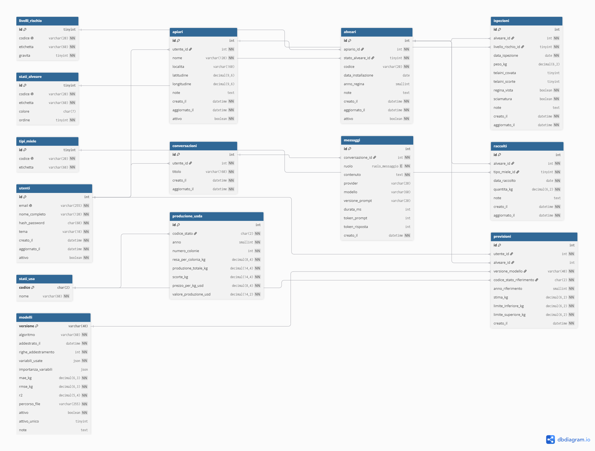

# Schema relazionale di BeeWatch AI

> **Task M2-T4** · Schema relazionale, diagramma ER e verifica sugli use case
> **Versione 3** — dopo la revisione tecnica documentata in fondo
> **Sorgente del diagramma:** [`docs/diagrams/er_diagram.dbml`](../../diagrams/er_diagram.dbml), da incollare su [dbdiagram.io](https://dbdiagram.io/d)
> **Diagramma:** `docs/diagrams/er_diagram.png`, esportato da dbdiagram
> **Traduzione in SQL:** `sql/schema.sql`, task **M2-T5**
> **Dipende da:** M2-T2 (dizionario e regole di pulizia), M2-T3 (target e limiti)

## Obiettivo

Progettare la struttura del database prima di scrivere una riga di SQL, e
verificare che ogni schermata dell'applicazione sia ottenibile con una query
ragionevole. Uno schema sbagliato non si scopre subito: si scopre in M6, quando
per riempire una pagina servono quattro giri di query annidate.

## I quattro livelli

Le quattordici tabelle appartengono a quattro mondi che non vanno mescolati.

| Livello | Tabelle | Chi le riempie |
|---|---|---|
| **Operativo** | `utenti`, `apiari`, `alveari`, `ispezioni`, `raccolti` | l'apicoltore, usando l'applicazione |
| **Riferimento** | `stati_alveare`, `livelli_rischio`, `tipi_miele`, `stati_usa`, `produzione_usda` | lo script di seed e l'ETL |
| **Modello** | `modelli` | lo script di addestramento, a ogni nuova versione (M4) |
| **Tracciabilità** | `previsioni`, `conversazioni`, `messaggi` | il sistema, mentre lavora |

**Perché tenerli separati.** I dati USDA sono un riferimento storico immutabile:
non appartengono a nessun utente, non si modificano, si ricaricano da capo con
l'ETL. I dati operativi sono personali e cambiano ogni giorno. La tracciabilità
è ciò che il sistema ha prodotto, e serve a spiegare le proprie decisioni.
Mescolarli renderebbe impossibile, per dirne una, cancellare un utente senza
distruggere il dataset di riferimento.

## Il diagramma



Le tabelle sono colorate per livello: ambra l'operativo, grigio il riferimento,
blu l'USDA, verde il modello, viola la tracciabilità.

### Come si modifica

Il diagramma **non si disegna a mano**: si modifica `docs/diagrams/er_diagram.dbml` e si
riesporta.

1. apri [dbdiagram.io/d](https://dbdiagram.io/d)
2. incolla il contenuto di `docs/diagrams/er_diagram.dbml` nel pannello di sinistra
3. *Export → PNG*, e sovrascrivi `docs/diagrams/er_diagram.png`

Da lì si può anche fare *Export → MySQL* e ottenere il DDL. **Non è ancora
`sql/schema.sql`**: DBML descrive modelli, non conosce `UNSIGNED`, i `CHECK`,
le colonne generate né la codifica dei caratteri. Le quattro cose da aggiungere
a mano sono elencate in fondo a `er_diagram.dbml`, numerate.

---

## Convenzioni di nomenclatura

Valgono senza eccezioni. Un nome fuori convenzione è un errore da correggere,
non una variante.

| Elemento | Regola | Esempio |
|---|---|---|
| Tabelle | plurale, minuscolo, senza accenti | `alveari`, `produzione_usda` |
| Chiave primaria | `id`, o la chiave naturale se esiste | `id`, `codice`, `versione` |
| Chiave esterna | `<tabella_al_singolare>_id` | `alveare_id`, `tipo_miele_id` |
| Date di sistema | `creato_il`, `aggiornato_il` — **sempre al maschile** | `creato_il` |
| Booleani | aggettivo affermativo, mai negato | `attivo`, `regina_vista` |
| Indici | `idx_<tabella>_<colonne>` | `idx_ispezioni_alveare_data` |
| Unicità | `uq_<tabella>_<colonne>` | `uq_alveari_apiario_codice` |

La regola sulle date merita una nota: in italiano verrebbe naturale scrivere
`creata_il` per una previsione e `creato_il` per un messaggio. **Non si fa**:
chi scrive una query non deve ricordare il genere di ogni tabella. La
grammatica perde, la memoria di chi lavora vince.

**Tipi.** Nel DDL tutti gli identificatori e i contatori sono `UNSIGNED`: un id
negativo non esiste. Attenzione, una chiave esterna deve avere *esattamente* lo
stesso tipo della colonna a cui punta, `UNSIGNED` compreso, o MySQL rifiuta il
vincolo.

---

## Le tabelle

### Livello operativo

#### `utenti`

| Colonna | Tipo | Vincoli |
|---|---|---|
| `id` | INT UNSIGNED AUTO_INCREMENT | PK |
| `email` | VARCHAR(255) | UNIQUE, NOT NULL |
| `nome_completo` | VARCHAR(120) | NOT NULL |
| `hash_password` | CHAR(60) | NOT NULL |
| `tema` | VARCHAR(10) | NOT NULL, DEFAULT `'auto'`, CHECK in (auto, chiaro, scuro) |
| `creato_il` | DATETIME | NOT NULL, DEFAULT CURRENT_TIMESTAMP |
| `aggiornato_il` | DATETIME | NOT NULL, DEFAULT CURRENT_TIMESTAMP ON UPDATE CURRENT_TIMESTAMP |
| `attivo` | BOOLEAN | NOT NULL, DEFAULT TRUE |

`hash_password` è lungo esattamente 60 caratteri perché conterrà un hash bcrypt.
**La password in chiaro non entra mai nel database**, nemmeno temporaneamente.

Due modi diversi di far sparire un utente, e servono entrambi: `attivo = false`
gli toglie l'accesso conservando i dati; il `DELETE` fisico è la cancellazione
GDPR e porta via tutto (query Q11).

`tema` è l'**unica** impostazione che vive nel database, e solo perché il
selettore chiaro/scuro deve ricordare la scelta fra una sessione e l'altra.
Tutto il resto della configurazione sta in `.env` (M1-T3): due fonti di verità
per la stessa impostazione sono il problema che quella task esisteva per
risolvere.

#### `apiari`

| Colonna | Tipo | Vincoli |
|---|---|---|
| `id` | INT UNSIGNED AUTO_INCREMENT | PK |
| `utente_id` | INT UNSIGNED | FK → `utenti.id`, ON DELETE CASCADE |
| `nome` | VARCHAR(120) | NOT NULL, UNIQUE insieme a `utente_id` |
| `localita` | VARCHAR(160) | |
| `latitudine` | DECIMAL(9,6) | CHECK fra −90 e 90 |
| `longitudine` | DECIMAL(9,6) | CHECK fra −180 e 180 |
| `note` | TEXT | |
| `creato_il` | DATETIME | NOT NULL, DEFAULT CURRENT_TIMESTAMP |
| `aggiornato_il` | DATETIME | NOT NULL, ON UPDATE CURRENT_TIMESTAMP |
| `attivo` | BOOLEAN | NOT NULL, DEFAULT TRUE |

Le coordinate sono **dati personali indiretti**: dicono dove si trova
fisicamente l'utente diverse volte a settimana. Vanno trattate come tali nel
documento etico (M7-T4) e non devono mai finire in un prompt inviato a un
provider LLM esterno.

`attivo` esiste per una ragione precisa: cancellare un apiario porta via a
cascata alveari, ispezioni e raccolti di **anni**. L'interfaccia archivia; la
cancellazione vera resta possibile ma vive in Impostazioni, dietro conferma.

Il nome è unico per utente: due apiari omonimi renderebbero ambigua ogni
schermata e ogni riepilogo.

#### `alveari`

| Colonna | Tipo | Vincoli |
|---|---|---|
| `id` | INT UNSIGNED AUTO_INCREMENT | PK |
| `apiario_id` | INT UNSIGNED | FK → `apiari.id`, ON DELETE CASCADE |
| `stato_alveare_id` | TINYINT UNSIGNED | FK → `stati_alveare.id`, ON DELETE RESTRICT |
| `codice` | VARCHAR(20) | UNIQUE insieme a `apiario_id` |
| `data_installazione` | DATE | |
| `anno_regina` | SMALLINT UNSIGNED | CHECK fra 2000 e 2100 |
| `note` | TEXT | |
| `creato_il` | DATETIME | NOT NULL, DEFAULT CURRENT_TIMESTAMP |
| `aggiornato_il` | DATETIME | NOT NULL, ON UPDATE CURRENT_TIMESTAMP |
| `attivo` | BOOLEAN | NOT NULL, DEFAULT TRUE |

Il codice è unico **dentro l'apiario**, non nel database: due apicoltori diversi
possono entrambi avere un alveare "A1", ed è giusto così.

`attivo` invece di cancellare: un alveare dismesso conserva il proprio storico
di ispezioni e raccolti, che resta valido.

#### `ispezioni`

| Colonna | Tipo | Vincoli |
|---|---|---|
| `id` | INT UNSIGNED AUTO_INCREMENT | PK |
| `alveare_id` | INT UNSIGNED | FK → `alveari.id`, ON DELETE CASCADE |
| `livello_rischio_id` | TINYINT UNSIGNED | FK → `livelli_rischio.id`, ON DELETE RESTRICT |
| `data_ispezione` | DATE | NOT NULL |
| `peso_kg` | DECIMAL(6,2) | CHECK ≥ 0 |
| `telaini_covata` | TINYINT UNSIGNED | CHECK ≤ 30 |
| `telaini_scorte` | TINYINT UNSIGNED | CHECK ≤ 30 |
| `regina_vista` | BOOLEAN | NOT NULL, DEFAULT FALSE |
| `sciamatura` | BOOLEAN | NOT NULL, DEFAULT FALSE |
| `note` | TEXT | |
| `creato_il` | DATETIME | NOT NULL, DEFAULT CURRENT_TIMESTAMP |
| `aggiornato_il` | DATETIME | NOT NULL, ON UPDATE CURRENT_TIMESTAMP |

`note` è la colonna più importante dell'intero schema per la componente AI: è
il testo libero che l'assistente riassume e da cui estrae i campi strutturati
(M5). Va prevista lunga e mai troncata.

`data_ispezione` è separata da `creato_il` perché si registra spesso la sera
un'ispezione fatta la mattina.

#### `raccolti`

| Colonna | Tipo | Vincoli |
|---|---|---|
| `id` | INT UNSIGNED AUTO_INCREMENT | PK |
| `alveare_id` | INT UNSIGNED | FK → `alveari.id`, ON DELETE CASCADE |
| `tipo_miele_id` | TINYINT UNSIGNED | FK → `tipi_miele.id`, ON DELETE RESTRICT |
| `data_raccolto` | DATE | NOT NULL |
| `quantita_kg` | DECIMAL(6,2) | NOT NULL, CHECK > 0 |
| `note` | TEXT | |
| `creato_il` | DATETIME | NOT NULL, DEFAULT CURRENT_TIMESTAMP |
| `aggiornato_il` | DATETIME | NOT NULL, ON UPDATE CURRENT_TIMESTAMP |

### Tabelle di riferimento

Hanno tutte la stessa forma: `id`, `codice` tecnico e stabile, `etichetta`
mostrata all'utente.

| Tabella | Colonne aggiuntive | Contenuto |
|---|---|---|
| `stati_alveare` | `colore` CHAR(7), `ordine` | in salute, debole, sciamato, morto, in osservazione |
| `livelli_rischio` | `gravita` TINYINT | nessuno, basso, medio, alto |
| `tipi_miele` | — | acacia, millefiori, castagno, tiglio, melata… |
| `stati_usa` | `codice` CHAR(2) come PK, `nome` | i 44 codici del dataset (M2-T2) |

### Il modello

#### `modelli`

| Colonna | Tipo | Vincoli |
|---|---|---|
| `versione` | VARCHAR(40) | PK — es. `v1.0.0` |
| `algoritmo` | VARCHAR(60) | NOT NULL — es. `RandomForestRegressor` |
| `addestrato_il` | DATETIME | NOT NULL |
| `righe_addestramento` | INT UNSIGNED | NOT NULL |
| `variabili_usate` | JSON | NOT NULL — es. `["codice_stato", "anno"]` |
| `importanza_variabili` | JSON | peso di ogni variabile |
| `mae_kg` | DECIMAL(6,3) | NOT NULL |
| `rmse_kg` | DECIMAL(6,3) | NOT NULL |
| `r2` | DECIMAL(5,4) | NOT NULL |
| `percorso_file` | VARCHAR(255) | NOT NULL — il `.joblib` in `models/` |
| `attivo` | BOOLEAN | NOT NULL, DEFAULT FALSE |
| `attivo_unico` | TINYINT UNSIGNED | colonna generata, UNIQUE |
| `note` | TEXT | |

**Un solo modello per volta ha `attivo = true`, ed è il database a garantirlo.**
MySQL non ha indici parziali, ma esiste un modo pulito per ottenerne l'effetto:

```sql
attivo_unico TINYINT UNSIGNED
  GENERATED ALWAYS AS (IF(attivo, 1, NULL)) VIRTUAL,
UNIQUE KEY uq_modelli_uno_attivo (attivo_unico)
```

I valori `NULL` non partecipano ai vincoli di unicità: possono quindi esistere
infinite righe inattive e **al massimo una attiva**. Un secondo
`UPDATE … SET attivo = TRUE` viene rifiutato dal database, non dall'applicazione.

`variabili_usate` e `importanza_variabili` sono la **spiegabilità** del modello:
dicono su quali variabili è stato addestrato e quanto ognuna pesa. Bastano a
costruire il grafico *«cosa influenza la stima»* senza aggiungere una tabella.

Le metriche stanno qui per tre motivi. Il docente chiede che il progetto le
dichiari. L'interfaccia deve poter scrivere *«modello v1.2, errore medio
3,8 kg»* accanto a una previsione, come stabilito in M2-T3. E la soglia di
accettazione — **MAE inferiore a 4,25 kg** — diventa un confronto fra due
numeri nel database, non un'opinione.

### Tracciabilità

#### `previsioni`

| Colonna | Tipo | Vincoli |
|---|---|---|
| `id` | INT UNSIGNED AUTO_INCREMENT | PK |
| `utente_id` | INT UNSIGNED | FK → `utenti.id`, ON DELETE CASCADE |
| `alveare_id` | INT UNSIGNED NULL | FK → `alveari.id`, ON DELETE SET NULL |
| `versione_modello` | VARCHAR(40) | FK → `modelli.versione`, RESTRICT, ON UPDATE CASCADE |
| `codice_stato_riferimento` | CHAR(2) | FK → `stati_usa.codice`, RESTRICT, ON UPDATE CASCADE |
| `anno_riferimento` | SMALLINT UNSIGNED | NOT NULL, CHECK fra 1990 e 2100 |
| `stima_kg` | DECIMAL(6,2) | NOT NULL |
| `limite_inferiore_kg` | DECIMAL(6,2) | NOT NULL |
| `limite_superiore_kg` | DECIMAL(6,2) | CHECK inferiore ≤ stima ≤ superiore |
| `creato_il` | DATETIME | NOT NULL, DEFAULT CURRENT_TIMESTAMP |

`anno_riferimento` **non** è una chiave esterna verso `produzione_usda`: si può
chiedere una stima per il 2026, che nel dataset non esiste. Lo stato invece lo
è, perché deve essere uno dei 44 rilevati.

Gli ingressi del modello sono qui per intero — stato e anno — quindi ogni
previsione è **riproducibile**: si ricarica il `.joblib` della versione indicata
e si ottiene lo stesso numero.

I due limiti sono obbligatori: M2-T3 stabilisce che una previsione si mostra
sempre come intervallo, e il vincolo `CHECK` impedisce anche di invertirli.

#### `conversazioni` e `messaggi`

| `conversazioni` | Tipo | | `messaggi` | Tipo |
|---|---|---|---|---|
| `id` | INT UNSIGNED | | `id` | INT UNSIGNED |
| `utente_id` | FK → `utenti`, CASCADE | | `conversazione_id` | FK → `conversazioni`, CASCADE |
| `titolo` | VARCHAR(160), DEFAULT | | `ruolo` | ENUM('utente','assistente','sistema') |
| `creato_il` | DATETIME | | `contenuto` | TEXT |
| `aggiornato_il` | DATETIME | | `provider`, `modello` | VARCHAR |
| | | | `versione_prompt` | VARCHAR(20) |
| | | | `durata_ms` | INT UNSIGNED |
| | | | `token_prompt`, `token_risposta` | INT UNSIGNED |
| | | | `creato_il` | DATETIME |

`provider` e `modello` su ogni messaggio, non sulla conversazione: l'utente può
cambiare provider a metà (M6, pagina Impostazioni), e chi legge lo storico deve
sapere chi ha prodotto quella specifica risposta.

Le cinque colonne tecniche sono nulle per i messaggi scritti dall'utente e
servono a cose concrete:

- **`versione_prompt`** è la prova del lavoro di prompt engineering che il
  docente richiede esplicitamente. Senza, «abbiamo migliorato il prompt» è
  un'affermazione; con, si mostrano due risposte alla stessa domanda prodotte
  da `v1` e `v3`.
- **`durata_ms`** rende dicibile in sede di demo che Ollama in locale impiega
  quattro secondi e OpenRouter uno: è il compromesso privacy/velocità che il
  documento etico deve discutere.
- **`token_prompt` e `token_risposta`** arrivano già nella risposta di entrambi
  i provider: costano due colonne e permettono di stimare il costo di una
  conversazione.

**Il testo dei prompt non sta nel database**: vive nel repository, dove git ne
versiona le modifiche con diff leggibili in pull request. A database basta il
riferimento alla versione. Tenerne una copia anche qui significherebbe
allinearle a mano.

---

## Relazioni e cardinalità

| Da | A | Cardinalità | ON DELETE | ON UPDATE |
|---|---|---|---|---|
| `utenti` | `apiari` | 1 : N | CASCADE | RESTRICT |
| `apiari` | `alveari` | 1 : N | CASCADE | RESTRICT |
| `alveari` | `ispezioni` | 1 : N | CASCADE | RESTRICT |
| `alveari` | `raccolti` | 1 : N | CASCADE | RESTRICT |
| `utenti` | `previsioni` | 1 : N | CASCADE | RESTRICT |
| `alveari` | `previsioni` | 0..1 : N | SET NULL | RESTRICT |
| `modelli` | `previsioni` | 1 : N | RESTRICT | **CASCADE** |
| `stati_usa` | `previsioni` | 1 : N | RESTRICT | **CASCADE** |
| `utenti` | `conversazioni` | 1 : N | CASCADE | RESTRICT |
| `conversazioni` | `messaggi` | 1 : N | CASCADE | RESTRICT |
| `stati_alveare` | `alveari` | 1 : N | RESTRICT | RESTRICT |
| `livelli_rischio` | `ispezioni` | 1 : N | RESTRICT | RESTRICT |
| `tipi_miele` | `raccolti` | 1 : N | RESTRICT | RESTRICT |
| `stati_usa` | `produzione_usda` | 1 : N | RESTRICT | **CASCADE** |

### La cascata è una scelta, non una comodità

Cancellare un utente cancella apiari, alveari, ispezioni, raccolti, previsioni e
conversazioni. **È l'implementazione del diritto alla cancellazione**
(GDPR art. 17): una `DELETE FROM utenti WHERE id = ?` e non resta niente.

`RESTRICT` sulle tabelle di riferimento fa l'opposto: impedisce di cancellare
"in salute" finché esiste un alveare che lo usa. Un'etichetta cancellata per
sbaglio lascerebbe righe che puntano al nulla.

`SET NULL` su `previsioni.alveare_id` è il caso intermedio: se l'alveare sparisce
la previsione resta, perché documenta cosa il sistema ha detto e quando. Senza
alveare non è più consultabile dalla sua scheda, ma la tracciabilità è salva.

### Perché tre relazioni hanno `ON UPDATE CASCADE`

Undici chiavi esterne su quattordici puntano a **chiavi surrogate**, che non
cambiano mai: per loro `RESTRICT` è corretto e non costa nulla.

Le altre tre puntano a **chiavi naturali** — `stati_usa.codice` e
`modelli.versione` — che qualcuno potrebbe correggere. Il caso realistico è
rinominare un modello da `v1.0` a `v1.0.0`: senza `CASCADE`, l'operazione
verrebbe rifiutata perché esistono previsioni che lo citano, e per rinominarlo
bisognerebbe cancellare lo storico. È esattamente il motivo per cui le chiavi
naturali si usano con parsimonia.

## Indici

**InnoDB crea da solo un indice su ogni colonna di chiave esterna**, ed è un
vincolo del motore, non un'ottimizzazione: senza indice il controllo di
integrità non sarebbe sostenibile. Dichiararli a mano produrrebbe indici
duplicati, che occupano spazio e rallentano ogni `INSERT`.

Si dichiarano quindi solo quelli che InnoDB **non** crea: i compositi e quelli
su colonne non vincolate.

```sql
CREATE INDEX idx_apiari_utente_attivo   ON apiari    (utente_id, attivo);
CREATE INDEX idx_ispezioni_alveare_data ON ispezioni (alveare_id, data_ispezione DESC);
CREATE INDEX idx_raccolti_alveare_data  ON raccolti  (alveare_id, data_raccolto DESC);
CREATE INDEX idx_previsioni_utente_data ON previsioni (utente_id, creato_il DESC);
CREATE INDEX idx_produzione_usda_anno   ON produzione_usda (anno);
CREATE INDEX idx_messaggi_conversazione_data
                                        ON messaggi (conversazione_id, creato_il);
CREATE INDEX idx_conversazioni_utente_aggiornato
                                        ON conversazioni (utente_id, aggiornato_il DESC);

CREATE UNIQUE INDEX uq_apiari_utente_nome         ON apiari  (utente_id, nome);
CREATE UNIQUE INDEX uq_alveari_apiario_codice     ON alveari (apiario_id, codice);
CREATE UNIQUE INDEX uq_produzione_usda_stato_anno ON produzione_usda (codice_stato, anno);
CREATE UNIQUE INDEX uq_modelli_uno_attivo         ON modelli (attivo_unico);
```

Un dettaglio che vale la pena conoscere: i compositi che **iniziano** con la
colonna di chiave esterna sostituiscono l'indice automatico. `(alveare_id,
data_ispezione)` copre anche la sola `alveare_id`, quindi InnoDB non ne crea un
secondo. È il motivo per cui l'ordine delle colonne in un indice composito non
è mai casuale.

Ogni indice di questo elenco è giustificato da una query della sezione
successiva. Nessuno è stato aggiunto "per sicurezza": un indice inutile è un
costo su ogni scrittura, pagato per sempre.

---

## Le query chiave

Undici query, una per ogni cosa che l'applicazione deve saper fare. Se una di
queste risultasse impossibile o assurdamente complicata, lo schema andrebbe
cambiato **adesso**, non a settembre.

### Q1 · Riepilogo della dashboard
*Serve a: pagina Dashboard, le caselle in alto.*

```sql
SELECT
    (SELECT COUNT(*)
       FROM alveari al
       JOIN apiari  ap ON ap.id = al.apiario_id
      WHERE ap.utente_id = :utente AND al.attivo AND ap.attivo)   AS alveari_attivi,

    (SELECT COUNT(*)
       FROM ispezioni i
       JOIN alveari   al ON al.id = i.alveare_id
       JOIN apiari    ap ON ap.id = al.apiario_id
      WHERE ap.utente_id = :utente
        AND i.data_ispezione >= CURDATE() - INTERVAL 30 DAY)      AS ispezioni_30_giorni,

    (SELECT COALESCE(SUM(r.quantita_kg), 0)
       FROM raccolti r
       JOIN alveari  al ON al.id = r.alveare_id
       JOIN apiari   ap ON ap.id = al.apiario_id
      WHERE ap.utente_id = :utente
        AND YEAR(r.data_raccolto) = YEAR(CURDATE()))              AS produzione_stagione_kg;
```

> **Perché non un unico `JOIN`.** La versione ovvia unisce `alveari` a
> `ispezioni` **e** a `raccolti` nella stessa query. Ma un alveare con 40
> ispezioni e 5 raccolti produce 200 righe intermedie, e i totali vanno
> corretti con `COUNT(DISTINCT)` e `CASE`. Con centomila ispezioni la dashboard
> — che si apre a ogni accesso — diventa la pagina più lenta dell'applicazione.
> Tre sottoquery indipendenti leggono ciascuna il proprio indice e non si
> moltiplicano fra loro.

### Q2 · Elenco degli alveari con l'ultima ispezione
*Serve a: pagina Alveari, la tabella principale.*

```sql
SELECT al.codice, ap.nome AS apiario, s.etichetta AS stato, s.colore,
       ult.data_ispezione AS ultima_ispezione, ult.peso_kg
FROM alveari al
JOIN apiari         ap ON ap.id = al.apiario_id
JOIN stati_alveare  s  ON s.id  = al.stato_alveare_id
LEFT JOIN LATERAL (
    SELECT i.data_ispezione, i.peso_kg
    FROM ispezioni i
    WHERE i.alveare_id = al.id
    ORDER BY i.data_ispezione DESC
    LIMIT 1
) AS ult ON TRUE
WHERE ap.utente_id = :utente
ORDER BY ap.nome, al.codice;
```

### Q3 · Alveari trascurati
*Serve a: avviso in Dashboard — "3 alveari non ispezionati da oltre un mese".*

```sql
SELECT al.codice, MAX(i.data_ispezione) AS ultima
FROM alveari al
JOIN apiari ap ON ap.id = al.apiario_id
LEFT JOIN ispezioni i ON i.alveare_id = al.id
WHERE ap.utente_id = :utente AND al.attivo = TRUE
GROUP BY al.id, al.codice
HAVING ultima IS NULL OR ultima < CURDATE() - INTERVAL 30 DAY;
```

### Q4 · Andamento del peso di un alveare
*Serve a: scheda dell'alveare, grafico dell'andamento.*

```sql
SELECT data_ispezione, peso_kg, telaini_covata, telaini_scorte
FROM ispezioni
WHERE alveare_id = :alveare AND peso_kg IS NOT NULL
ORDER BY data_ispezione;
```

### Q5 · Produzione per stagione
*Serve a: pagina Report, grafico a barre per anno.*

```sql
SELECT YEAR(r.data_raccolto) AS anno, tm.etichetta AS tipo,
       SUM(r.quantita_kg) AS totale_kg
FROM raccolti r
JOIN alveari    al ON al.id = r.alveare_id
JOIN apiari     ap ON ap.id = al.apiario_id
JOIN tipi_miele tm ON tm.id = r.tipo_miele_id
WHERE ap.utente_id = :utente
GROUP BY anno, tm.etichetta
ORDER BY anno DESC;
```

### Q6 · Ispezioni a rischio alto
*Serve a: pagina Ispezioni, filtro sul rischio.*

```sql
SELECT al.codice, i.data_ispezione, lr.etichetta AS rischio, i.note
FROM ispezioni i
JOIN alveari         al ON al.id = i.alveare_id
JOIN apiari          ap ON ap.id = al.apiario_id
JOIN livelli_rischio lr ON lr.id = i.livello_rischio_id
WHERE ap.utente_id = :utente
  AND lr.gravita >= 3
  AND i.data_ispezione >= CURDATE() - INTERVAL 60 DAY
ORDER BY i.data_ispezione DESC;
```

### Q7 · Serie storica USDA di uno stato
*Serve a: pagina Previsioni, grafico del riferimento storico.*

```sql
SELECT anno, resa_per_colonia_kg, numero_colonie
FROM produzione_usda
WHERE codice_stato = :stato
ORDER BY anno;
```

### Q8 · Dati di addestramento del modello
*Serve a: M4, costruzione del dataset. Solo i 40 stati con la serie completa
(regola R10 di M2-T2).*

```sql
SELECT p.codice_stato, p.anno, p.numero_colonie, p.resa_per_colonia_kg
FROM produzione_usda p
WHERE p.codice_stato IN (
    SELECT codice_stato FROM produzione_usda
    GROUP BY codice_stato HAVING COUNT(*) = 15
)
ORDER BY p.codice_stato, p.anno;
```

### Q9 · Ultime previsioni dell'utente
*Serve a: pagina Previsioni, storico in fondo.*

```sql
SELECT pr.creato_il, al.codice AS alveare, pr.stima_kg,
       pr.limite_inferiore_kg, pr.limite_superiore_kg,
       m.versione, m.algoritmo, m.mae_kg
FROM previsioni pr
JOIN      modelli m  ON m.versione = pr.versione_modello
LEFT JOIN alveari al ON al.id = pr.alveare_id
WHERE pr.utente_id = :utente
ORDER BY pr.creato_il DESC
LIMIT 20;
```

Con il join su `modelli` la schermata può scrivere accanto a ogni stima **con
quale modello è stata prodotta e quanto quel modello sbaglia in media**. Prima
della revisione, `versione_modello` era una stringa che non portava da nessuna
parte.

### Q10 · Una conversazione con i suoi messaggi
*Serve a: pagina Assistente AI, riapertura di una conversazione.*

```sql
SELECT m.ruolo, m.contenuto, m.provider, m.modello, m.versione_prompt,
       m.durata_ms, m.creato_il
FROM messaggi m
JOIN conversazioni c ON c.id = m.conversazione_id
WHERE c.id = :conversazione AND c.utente_id = :utente
ORDER BY m.creato_il;
```

### Q11 · Cancellazione di un utente
*Serve a: GDPR art. 17, e alla pagina Impostazioni.*

```sql
DELETE FROM utenti WHERE id = :utente;
```

Una riga. Tutto il resto — apiari, alveari, ispezioni, raccolti, previsioni,
conversazioni, messaggi — sparisce per effetto delle cascate. **Questa query è
la dimostrazione che lo schema è progettato bene**: se avesse richiesto sette
`DELETE` in ordine, vorrebbe dire che le relazioni non erano dichiarate.

---

## Decisioni progettuali

**D1 · Tre livelli separati.** Dati dell'utente, riferimento USDA e output del
sistema non si mescolano. Permette di ricaricare il dataset senza toccare i dati
personali, e di cancellare un utente senza intaccare il riferimento.

**D2 · Multiutente fin da subito.** Ogni tabella operativa risale a `utenti`.
Aggiungere l'isolamento dopo avrebbe significato modificare cinque tabelle,
tutte le query e tutte le schermate.

**D3 · Tabelle di riferimento invece di ENUM.** Gli stati dell'alveare hanno
un'etichetta e un colore che servono all'interfaccia. Con un `ENUM` quei valori
vivrebbero nel codice della UI; in una tabella vivono nei dati, si traducono e
si estendono senza toccare lo schema. `ruolo_messaggio` resta invece un `ENUM`:
tre valori fissi che nessuno traduce né colora.

**D4 · Niente colonne calcolate memorizzate nell'operativo.** Non esiste
`produzione_totale` sull'alveare: si ottiene con `SUM(raccolti.quantita_kg)`.
È la stessa lezione dell'osservazione 2 di `dati.md` — un valore memorizzato che
dipende da altri è un valore che prima o poi diverge.

**D5 · `DECIMAL`, mai `FLOAT`.** Pesi, quantità e coordinate sono in `DECIMAL`.
`FLOAT` introduce errori di arrotondamento che su una somma di raccolti si
vedono, e su una latitudine spostano l'apiario di metri.

**D6 · L'intervallo di previsione è obbligatorio.** I due limiti sono `NOT NULL`
con un `CHECK` che ne garantisce l'ordine. Una decisione presa in M2-T3 e resa
impossibile da aggirare dallo schema.

**D7 · `attivo` invece di cancellare.** Utenti, apiari e alveari si disattivano.
Lo storico resta consultabile e le statistiche degli anni passati non cambiano
da sole.

**D8 · `utf8mb4` ovunque.** Le note degli apicoltori conterranno accenti e, con
ogni probabilità, emoji. `utf8` di MySQL non è UTF-8 completo: `utf8mb4` sì.
Collazione `utf8mb4_unicode_ci`, così il confronto fra email è insensibile alle
maiuscole.

**D9 · Le chiavi primarie sono numeriche e interne**, tranne dove esiste una
chiave naturale davvero stabile (`stati_usa.codice`, `modelli.versione`). Per
quelle due si paga il prezzo con `ON UPDATE CASCADE`.

**D10 · L'invariante "un solo modello attivo" sta nel database.** Una colonna
generata più un indice unico: l'applicazione non può sbagliare nemmeno
volendo. Le invarianti che si possono esprimere nello schema non si delegano al
codice.

---

## Revisione tecnica — versione 3

La prima stesura è stata riletta con criteri di ingegneria del software. Qui
c'è cosa è cambiato e perché, comprese le proposte **respinte**: sapere cosa si
è deciso di non fare vale quanto sapere cosa si è fatto.

### Modifiche applicate

| # | Modifica | Priorità | Motivazione |
|---|---|---|---|
| 1 | Nuova tabella `modelli` | **Alta** | `versione_modello` era una stringa senza referente: nessuno poteva risalire a quale modello avesse prodotto una stima, né alle sue metriche. Ora la previsione è riproducibile e l'interfaccia può dichiarare l'errore medio del modello, come M2-T3 impone. |
| 2 | Q1 riscritta con sottoquery | **Alta** | Il join simultaneo di `ispezioni` e `raccolti` moltiplica le righe. Su centomila ispezioni la dashboard sarebbe diventata la pagina più lenta dell'app. |
| 3 | `aggiornato_il` con `DEFAULT CURRENT_TIMESTAMP` | **Alta** | Una colonna `NOT NULL` senza `DEFAULT` fa fallire ogni `INSERT` che non la valorizzi: `ON UPDATE` agisce solo sugli aggiornamenti. Era un errore che si sarebbe manifestato al primo `seed.sql`. |
| 4 | `ON UPDATE CASCADE` sulle 3 FK verso chiavi naturali | **Alta** | Rinominare un modello da `v1.0` a `v1.0.0` sarebbe stato rifiutato finché esisteva una previsione che lo citava. |
| 5 | `attivo_unico` generata + `UNIQUE` su `modelli` | **Alta** | "Un solo modello attivo" era una nota nel documento. Ora è un vincolo che MySQL fa rispettare. |
| 6 | Nomi uniformati | **Alta** | `creata_il`/`creato_il` convivevano, e `stato_id` puntava a `stati_alveare` mentre `rischio_id` puntava a `livelli_rischio`. |
| 7 | `UNSIGNED` su identificatori e contatori | Media | Raddoppia il campo positivo e rende esplicito che un id negativo non esiste. Va fatto ora: le FK devono avere tipo identico alla colonna a cui puntano. |
| 8 | Indici sulle FK rimossi, aggiunti due compositi | Media | InnoDB crea da solo quelli sulle FK: dichiararli produceva duplicati. Mancavano invece `(conversazione_id, creato_il)` e `(utente_id, aggiornato_il)`, senza i quali l'ordinamento avviene in memoria. |
| 9 | `UNIQUE (utente_id, nome)` su `apiari` | Media | Due apiari omonimi dello stesso utente rendono ambigua ogni schermata. |
| 10 | `apiari.attivo` | Media | Cancellare un apiario porta via a cascata anni di ispezioni. Serviva la stessa rete di sicurezza già presente sugli alveari. |
| 11 | `conversazioni.titolo` con `DEFAULT` | Media | Il titolo si genera dal primo messaggio: senza default, ogni inserimento dovrebbe passare un segnaposto. |
| 12 | `versione_prompt`, `durata_ms`, `token_prompt`, `token_risposta` | Media | Quattro colonne nulle per i messaggi dell'utente. Rendono dimostrabile il prompt engineering che il docente richiede, e misurabile il compromesso fra Ollama locale e provider esterno. |
| 13 | `variabili_usate` e `importanza_variabili` su `modelli` | Media | È la spiegabilità del modello, in due colonne invece che in una tabella. |
| 14 | `utenti.tema` | Bassa | Il selettore chiaro/scuro deve ricordare la scelta fra le sessioni. |

### Proposte respinte

**`updated_by` sulle tabelle operative.** Ogni riga appartiene a un solo utente,
raggiungibile risalendo le chiavi esterne: la colonna ripeterebbe
un'informazione già presente. Servirebbe solo se più persone potessero
modificare gli stessi dati, cosa che questo progetto esclude.

**Soft delete generalizzato (`deleted_at` ovunque).** Obbligherebbe **ogni**
query del progetto ad aggiungere `WHERE deleted_at IS NULL`, per sempre.
Dimenticarlo una volta sola significa mostrare dati cancellati. Il costo è
permanente, il beneficio riguarda ispezioni e raccolti che l'utente cancella
raramente. La protezione è concentrata dove serve — `attivo` su utenti, apiari
e alveari, cioè le entità che portano con sé uno storico — e altrove la
cancellazione resta fisica.

**Tabella delle configurazioni.** La configurazione vive in `.env` (M1-T3). Una
tabella parallela creerebbe due fonti di verità, che è il problema che quella
task esisteva per risolvere. L'unica eccezione è `utenti.tema`, che è una
preferenza personale e non una configurazione di sistema.

**Tabella delle notifiche.** Fuori scope: le notifiche sono già state tolte dal
mockup dell'interfaccia.

**Tabella separata per il log delle predizioni.** `previsioni` **è** il log: una
seconda tabella conterrebbe le stesse righe.

**Tabella dei prompt di sistema.** I prompt sono codice: vivono nel repository e
li versiona git, con differenze leggibili in pull request. Nel database basta
`versione_prompt` per collegare una risposta al prompt che l'ha generata.

**Storico delle modifiche alle ispezioni.** `aggiornato_il` risponde alla
domanda che ci si pone davvero — *quando* è stato toccato. Il *cosa*
richiederebbe di raddoppiare le scritture per una schermata che non esiste.

**Temperatura del modello sui messaggi.** È fissata in configurazione: sarebbe
una colonna che ripete lo stesso valore per ogni riga. Diventerà utile solo se
l'utente potrà regolarla dalle Impostazioni.

**Punteggio di confidenza sui messaggi.** Un modello di linguaggio non produce
una confidenza interpretabile. Mostrarne una inventata è esattamente la falsa
precisione che M2-T3 vieta.

**Chiave primaria naturale su `produzione_usda`.** La coppia (`codice_stato`,
`anno`) sarebbe legittima e risparmierebbe un indice. Si è preferita la chiave
surrogata per uniformità: tutte le tabelle transazionali usano `id`, e una sola
eccezione costringerebbe a ricordarsela.

### Normalizzazione

Lo schema è in **terza forma normale**, con due ridondanze dichiarate.

`produzione_usda` contiene due colonne derivabili: `produzione_totale_kg` è
esattamente `numero_colonie × resa_per_colonia_kg`, e `valore_produzione_usd` è
il prodotto di produzione e prezzo, arrotondato al migliaio dalla fonte. È una
**denormalizzazione consapevole**: è una tabella di sola lettura, ricaricata per
intero dall'ETL, e conservare i valori originali permette di verificare i dati
contro il file USDA. Il rischio della denormalizzazione — che i valori divergano
per un aggiornamento parziale — non esiste, perché nessuno aggiorna una riga
singola.

`conversazioni.aggiornato_il` duplica `MAX(messaggi.creato_il)`. Serve a
ordinare l'elenco delle conversazioni per attività recente senza scandire i
messaggi, e si aggiorna nella stessa transazione che inserisce il messaggio.

Nell'operativo non ci sono derivazioni: la produzione di un alveare è sempre
`SUM(raccolti.quantita_kg)`, mai una colonna.

### Comportamento su volumi realistici

Con migliaia di apiari, centomila ispezioni e migliaia di conversazioni:

| Query | Come si comporta |
|---|---|
| Q1 dashboard | tre letture su indice, indipendenti fra loro |
| Q2 elenco alveari | una ricerca su `idx_ispezioni_alveare_data` per alveare — decine di righe lette, non centomila |
| Q3 alveari trascurati | aggregazione sul solo insieme degli alveari dell'utente |
| Q5 produzione per anno | `YEAR(data_raccolto)` in `GROUP BY` non usa indice, ma opera su poche migliaia di righe già filtrate per utente |
| Q10 messaggi | ricerca diretta sull'indice composito, già ordinata |

Nessuna query fa una scansione completa di `ispezioni` o `messaggi`, che sono
le due tabelle destinate a crescere.

### Dati personali

| Dato | Trattamento |
|---|---|
| Password | solo hash bcrypt, mai il testo in chiaro |
| Email | unica, con collazione insensibile alle maiuscole |
| Coordinate degli apiari | dato personale indiretto: non entrano mai in un prompt inviato all'esterno |
| Note delle ispezioni | possono contenere dati personali e finiscono nel prompt dell'assistente: con Ollama restano sul computer, con OpenRouter escono e va detto all'utente |
| Conversazioni | cancellabili singolarmente; spariscono tutte con l'utente |
| Cancellazione | `DELETE FROM utenti` rimuove ogni dato collegato: art. 17 GDPR |

## Cosa non c'è, e perché

- **Nessun dato meteorologico.** Sarebbe utilissimo al modello, ma richiede
  un'API esterna e non è nel backlog. Resta come estensione (MX).
- **Nessuna tabella dei ruoli o dei permessi.** Un solo tipo di utente:
  l'apicoltore vede i propri dati. Non esiste un amministratore.
- **Nessun registro delle esecuzioni ETL.** Il conteggio degli scarti previsto
  da M2-T2 finisce nel log applicativo (M1-T4), che è il posto giusto per un
  dato operativo che nessuno interroga con una query.

## Approvazione

Lo schema va approvato esplicitamente da tutti e tre prima di M2-T5: una volta
scritto `sql/schema.sql` e caricati i dati, cambiarlo costa molto di più.

| Chi | Data | Esito |
|---|---|---|
| Imad (tech lead) | | |
| Membro B | | |
| Membro C | | |

Punti su cui vale la pena fermarsi un momento prima di firmare:

1. Le ispezioni registrano i campi giusti? Manca qualcosa che l'apicoltore
   annota sempre e che qui non ha una colonna?
2. Serve un'entità **trattamento** (antivarroa, nutrizione) separata dalle
   ispezioni, o basta il campo note?
3. I raccolti sono per alveare o per apiario? Qui sono per alveare, il che
   presuppone che si smieli tenendo separati i melari.

Sono domande di dominio, non di progettazione: la risposta va chiesta a chi le
api le tiene davvero.
